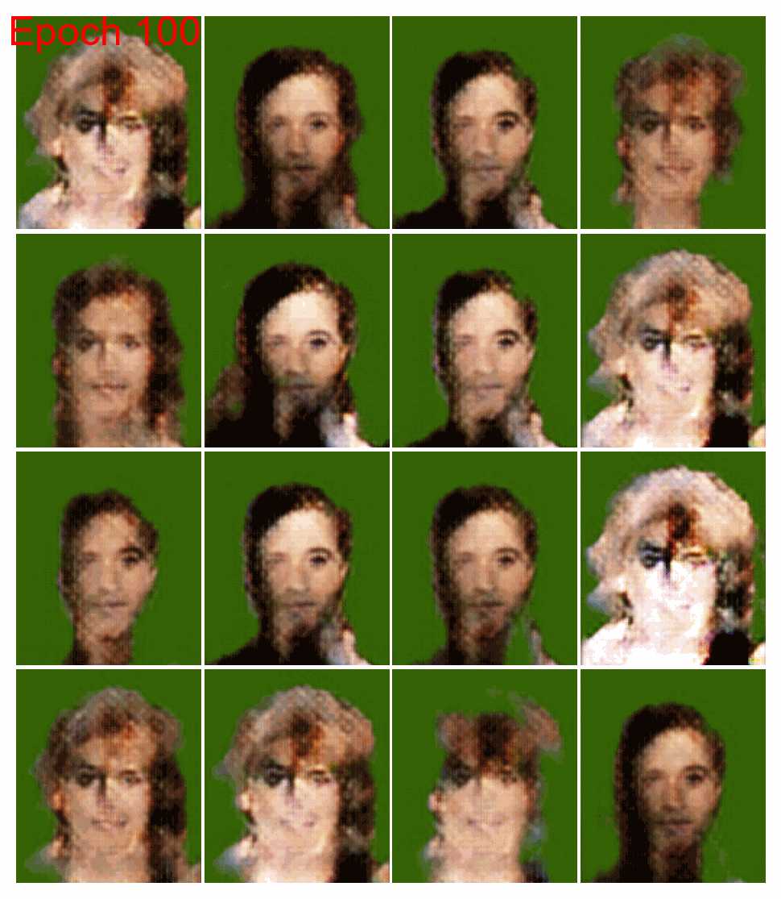

# **MLOps_CelebFaces_GAN**

This project implements a **GAN (Generative Adversarial Network)** to generate images of celebrity faces using the **CelebA** dataset. It is designed to follow **MLOps** best practices, facilitating the development, deployment, and monitoring of machine learning models.

---

## **Project Structure**

Here is the organization of the files and folders in the project:

```
MLOps_CelebFaces_GAN/
├── config/
│   ├── config.json        
├── data/
├── docs/
├── GAN_Project/
│   ├── application/     
│   ├── domain/          
│   ├── infrastructure/  
│   ├── Demo GAN.ipynb   
├── logs/
├── training/
│   ├── generated_images/
│   ├── saved_models/             
├── requirements.txt     
├── README.md            
```

---

## **Installation**

### 1. Clone the repository:
```sh
git clone https://github.com/Thoprr/MLOps_CelebFaces_GAN.git
cd MLOps_CelebFaces_GAN
```

### 2. Create and activate a virtual environment:
On **Linux/MacOS**:
```sh
python -m venv .venv
source .venv/bin/activate
```

On **Windows**:
```sh
python -m venv .venv
.venv\Scripts\activate
```

### 3. Install dependencies:
```sh
pip install -r requirements.txt
```

---

## **Configuration**

The `config.json` file contains essential parameters such as:
- Directory paths (`data_dir`, `model_dir`, etc.)
- Training hyperparameters (`learning_rate`, etc.)

Here is an example configuration:
```json
{
    "data_dir": "./GAN_Project/data",
    "model_dir": "./GAN_Project/models",
    "logs_dir": "./GAN_Project/logs"
}
```

---

## **Usage**

### 1. **Data Loading and Transformation**
Execute the following cell in the `Demo GAN.ipynb` notebook:
```python
data_load_transform(n_image=1000, n_jobs=-1)
```

### 2. **Training the GAN**
To train the GAN, use the function:
```python
train_gan(epochs=50, batch_size=32)
```

### 3. **Loading a Saved Model**
To use a pre-trained generator:
```python
generator = load_generator_model("generator_epoch_1440.keras")
```

### 4. **Creating an Animation GIF**
To visualize the evolution of the generated images:
```python
create_gif("../generated_images.gif", duration=300)
```

### 5. **Monitoring Performance**
Training metrics are saved in a CSV file. For example:
```python
monitoring("log_20241220_222321.csv")
```

---

## **Key Features**

- **MLOps-Friendly**: Modular and standardized organization.
- **Automated Saving**: Models are saved after each epoch.
- **Training Resumption**: Easy to resume training and add more images.
- **Intuitive Visualization**: GIF generation to track results evolution.
- **Structured Logging**: Metrics are logged in CSV files.
- **API**: Image generation API.

---

## **Future Improvements**

- CI/CD automation with continuous integration.
- Deployment on cloud services (AWS, Azure, GCP) using Nvidia Docker for training.
- Deployment on cloud services (AWS, Azure, GCP) using Docker for the API.
- Replace manual logging with **MLflow**.
- Improve the robustness of the API.

---

## **Author**

This project was developed as part of a university project focusing on **MLOps** and **Deep Learning**.

## **Generated Images**

Here is an example of the generated images over the training process:

